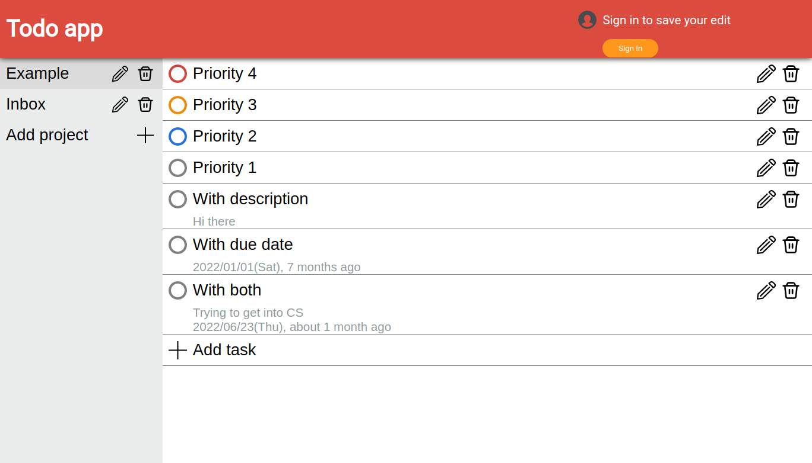

# Todo-list
A todo list project, the user can add/edit projects and tasks, the tasks also contains description and due date. 
The user can also login with google, and save their edits.
# Details
- Using webpack to bundle files
- Visual design is mostly by Todoist app
- Using firebase to do google authentication
- Using firebase to store data of users

# Result

# Link
[Live Preview](https://todo-list-6452b.web.app)